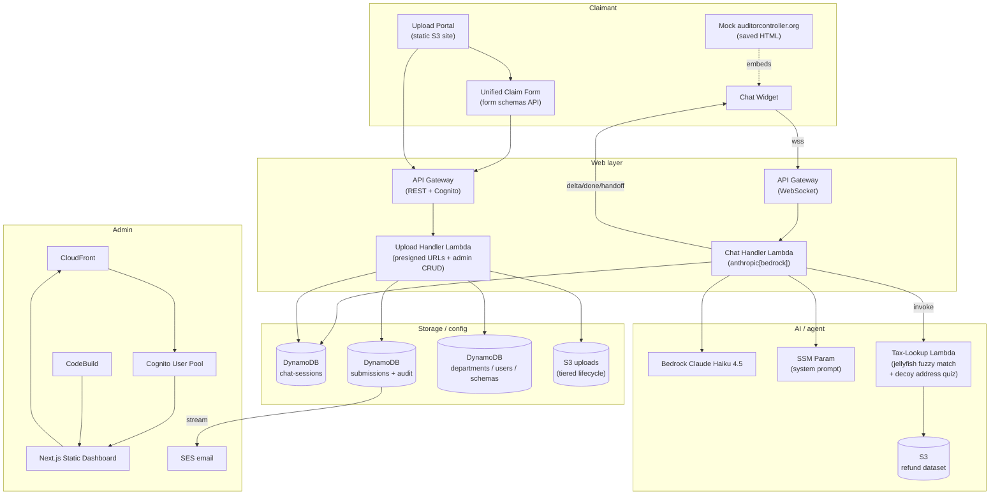
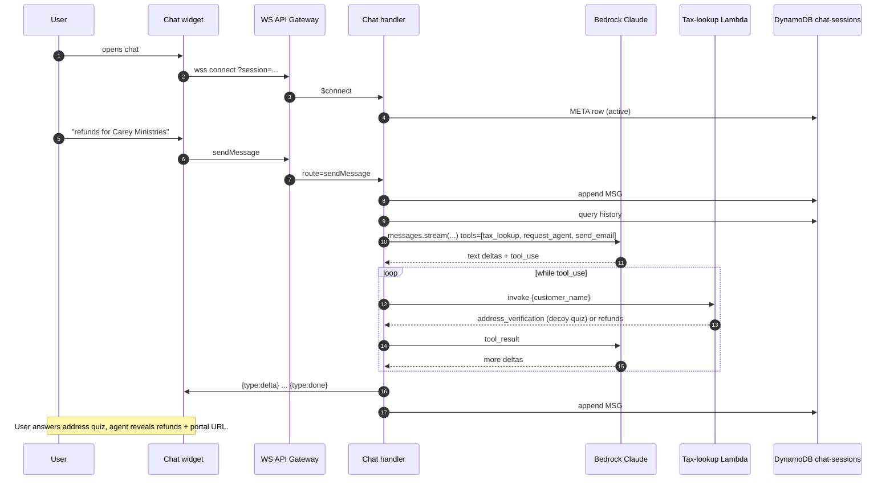

# Architecture

Two surfaces, one stack:

- **Claimant-facing chat** — a vanilla-JS widget on the auditor-controller mock website opens a WebSocket to API Gateway, which invokes a Lambda that drives Bedrock Claude Haiku 4.5 with three tools (`tax_lookup`, `request_agent`, `send_email`). Conversations persist in DynamoDB.
- **Admin dashboard** — Next.js static export on CloudFront, authed via Cognito. Reviews submissions, edits form schemas / departments / users / doc requirements, watches for chat handoffs, and renders filled AP-13 PDFs from claimant submissions.

## Conversational flow

## Stacks at a glance

| Resource | What it does |
|---|---|
| `aws_lambda.Function "Function"` | Tax-lookup tool backend; jellyfish fuzzy match; runs the decoy-address identity quiz; returns portal URL |
| `aws_lambda.Function "ChatHandler"` | WebSocket handler; manual Bedrock Claude agent loop; tool dispatch; persists transcript |
| `aws_lambda.Function "UploadHandler"` | Presigned-URL minting for claim uploads; admin CRUD over departments / users / form schemas / doc requirements / chat sessions |
| `aws_lambda.Function "NotificationHandler"` | DynamoDB stream → SES email on submission state changes |
| `aws_apigatewayv2.WebSocketApi "ChatWebSocket"` | `$connect / $disconnect / $default / sendMessage` routes → ChatHandler |
| `aws_apigateway.RestApi "UploadApi"` | `/upload`, `/upload-complete`, `/form-schemas`, `/doc-requirements` (public); `/admin/*`, `/audit/*`, `/package`, `/status`, `/update-status`, `/delete-submission` (Cognito) |
| `aws_dynamodb.Table "AppData"` | Submissions (META) + per-submission audit rows; `listIx` GSI for dashboard listing |
| `aws_dynamodb.Table "AdminConfig"` | Single table for `DEPT#`, `USER#`, `TYPELABEL#`, `DOCREQ#`, `FORMSCHEMA#` rows |
| `aws_dynamodb.Table "ChatSessions"` | `SESSION#<id>` partitions with `META`, `MSG#<ts>`, `HANDOFF` rows; `handoffIx` GSI for the admin queue |
| `aws_ssm.StringParameter "ChatSystemPrompt"` | Advanced-tier param holding the agent's prompt; live-editable without redeploy |
| `aws_s3.Bucket "DataBucket"` | `refunds_demo_balanced.jsonl` shipped via `BucketDeployment` |
| `aws_s3.Bucket "UploadsBucket"` | Claimant uploads; tiered lifecycle (hot → warm → cold → expire) |
| `aws_s3.Bucket "PortalBucket"` | Static upload portal site (unified claim form + chat widget assets) |
| `aws_s3.Bucket "AdminBucket"` | CloudFront-served Next.js static export of the admin dashboard |
| `aws_cognito.UserPool "AdminUserPool"` | Username/email auth for the admin dashboard with `super-admin` and per-department groups |
| `aws_codebuild.Project "AdminBuild"` | Triggered each `cdk deploy`; `yarn build` of admin-dashboard from GitHub branch in `config.yaml`; publishes to AdminBucket |

## Key design choices

**Why WebSocket and not REST polling?** Streaming Claude tokens to the browser as they arrive matters for perceived responsiveness — full responses can take 5-10s, so the user wants to see "typing" right away. WebSockets also keep `$connect`/`$disconnect` lifecycle events natural for session bookkeeping.

**Why a manual agent loop instead of the SDK tool runner?** The SDK runner returns whole messages; we need per-token streaming over the WebSocket. The loop in `bot/chat_handler/lambda_function.py` is small and explicit — it streams text deltas live, dispatches tools when the response stops with `tool_use`, then continues until `end_turn`.

**Why store assistant content blocks (not just text)?** Claude returns `{text, tool_use, thinking}` content blocks. To replay the conversation on the next turn (for tool-result follow-ups), the entire block array has to come back in. We strip response-only fields like `parsed_output` before persisting — the input API rejects them. See `_run_claude_loop` in the chat handler.

**Why the address-quiz handoff (instead of giving them straight to the refund)?** Identity verification matters when the system reveals dollar amounts and warrant numbers. The decoy quiz uses the customer's real address as one of four streets and rejects anything else. The model is hard-prompted not to reveal refund details until the tool returns a `refunds` payload (post-verification), and not to fabricate URLs.

**Why a reference-number agent handoff (instead of live transfer)?** A web chat can't directly transfer a phone call, so the simplest equivalent is: bot generates `REF-XXXXX`, persists the transcript, tells the user to call (951) 955-3800 and quote it. The admin dashboard surfaces pending handoffs; staff pick them up async with full context.

**Why drop the Bedrock Knowledge Base?** OpenSearch Serverless costs ~$700/mo to host roughly 12 small auditor-controller webpages. The FAQ content (deadlines, processing times) lives directly in the system prompt; for everything else the agent points the user to auditorcontroller.org or (951) 955-3800. Trade-off: no dynamic re-crawling, no citations.

**Why local Lambda bundling instead of Docker?** `bot/infrastructure.py`'s `_LocalBundling` runs `pip install --platform manylinux2014_x86_64 --only-binary=:all:` to fetch Lambda-compatible wheels without spawning a container. Faster (~30s vs ~3min), no Docker dependency on developer machines.
