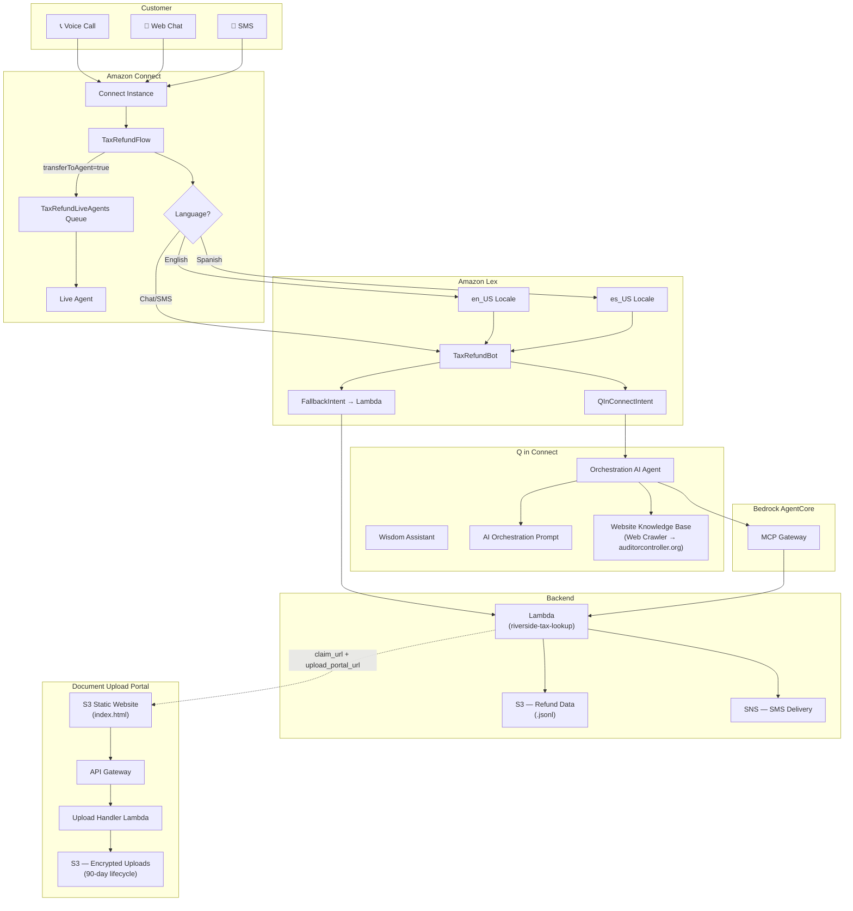

# Architecture

## Component Summary

| Component | Purpose |
|-----------|---------|
| Amazon Connect | Omnichannel contact center (voice, chat, SMS) |
| Amazon Lex | NLU bot with en_US and es_US locales |
| Q in Connect | Orchestration AI agent with tool use |
| Bedrock AgentCore | MCP gateway exposing `tax_lookup` and `send_sms` tools |
| Lambda (tax-lookup) | Fuzzy name matching against refund data, SMS sending via SNS |
| S3 (data) | JSONL refund records with deadline filtering |
| Knowledge Base | Web crawler indexing auditorcontroller.org for general Q&A |
| Upload Portal | Static site + API Gateway + Lambda for presigned S3 uploads |
| SNS | Sends claim form links via SMS to voice callers |
| Connect Queue | Live agent handoff when bot can't help or user is frustrated |
