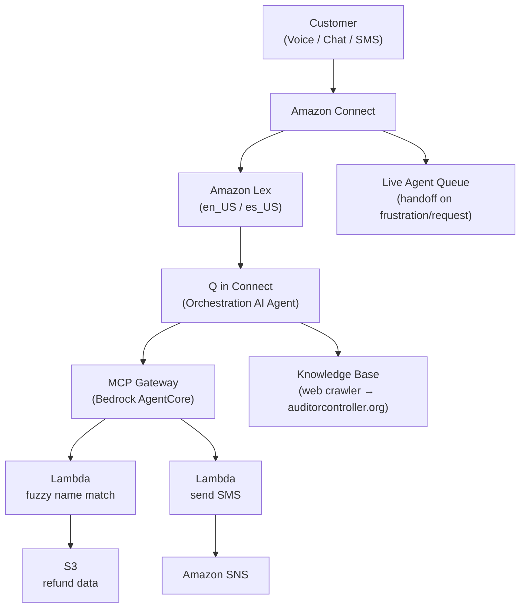

# Riverside County Tax Refund Lookup

| Index                                   | Description                                                      |
|:----------------------------------------|:-----------------------------------------------------------------|
| [Overview](#overview)                   | See the motivation behind this project                           |
| [Description](#description)             | Learn more about the problem, and how we approached the solution |
| [Deployment](#deployment)               | How to install and deploy the solution                           |
| [Usage](#usage)                         | How to use the Tax Refund Lookup bot                             |
| [Troubleshooting](#troubleshooting)     | Common issues and solutions                                      |
| [Lessons Learned](#lessons-learned)     | Key takeaways and insights from the project, and next steps      |
| [Bill of Materials](#bill-of-materials) | Cost of deployment and resources used                            |
| [Credits](#credits)                     | Meet the team behind this project                                |
| [License](#license)                     | See the project's license information                            |
| [Disclaimers](#disclaimers)             | Disclaimers information                                          |

# Overview

Riverside County Tax Refund Lookup is an **AI-powered, omnichannel self-service agent** that helps residents and businesses discover and claim unclaimed tax refunds through voice calls, web chat, or SMS. The solution uses Amazon Connect with Nova Sonic speech-to-speech capabilities to deliver a natural, conversational experience across all channels.

This project was initiated in response to a real-world challenge faced by the Riverside County Auditor-Controller's office. The county holds unclaimed funds across multiple sources — property tax overpayments, stale-dated warrants from general accounting, and payroll refunds — each managed by different divisions with separate databases, different claim forms, and different statutes of limitations. Residents who may be owed money have no single place to check, and the existing lookup process requires them to navigate multiple web pages, download PDF forms, print and fill them out by hand, and mail or email them back with supporting documentation like a driver's license and proof of address.

This fragmented, manual process creates barriers for constituents and workload for staff. Common names can match multiple records across divisions, making identity verification critical. Expired refunds must be handled carefully — once a claim deadline passes, funds revert to the general fund by government code, and the county does not want to surface expired records that would generate exception requests. Meanwhile, active refunds need urgency: residents should see their claim deadlines so they know to act quickly.

By deploying an AI agent, the county can consolidate all unclaimed fund sources into a single conversational interface, serve callers around the clock across voice, chat, and SMS, verify identity through address confirmation, and guide users directly to the correct claim forms — or, in the future, handle the entire claims process digitally.

**_While built for Riverside County, the solution is designed to be adaptable for any government agency or organization that needs to provide secure, AI-assisted record lookups over voice, chat, and SMS channels. The AI agent's behavior, data sources, and verification logic can be customized through configuration to match different use cases._**

# Description

## Problem Statement

The Riverside County Auditor-Controller's office holds a significant volume of unclaimed funds that residents and businesses are entitled to claim. These funds span multiple divisions — property tax overpayments, stale-dated warrants from general accounting, and payroll refunds — each with its own database, claim form, and statute of limitations. Property tax refunds follow one set of deadline rules, stale warrants follow another (typically four years), and payroll refunds for county employees may have no expiration at all.

Today, constituents must navigate separate web pages to search for their name, then download the correct PDF form (a property tax claim form or an AP-13 affidavit, depending on the refund type), fill it out by hand, and mail or email it back along with supporting documentation such as a photo ID and proof of address. There is no unified lookup, no automated assistance, and no secure digital portal for document submission. The process is entirely manual and only accessible during business hours.

This creates several compounding problems:
- **Discoverability**: Many residents don't know they have unclaimed funds, and those who do must search multiple databases independently.
- **Identity verification**: Common names produce multiple matches. The county must verify claimants through address confirmation and documentation, but the current process provides no automated way to do this before a user starts filling out paperwork.
- **Deadline management**: Once a claim deadline passes, funds revert to the general fund by government code. The county needs to surface active refunds with their deadlines to create urgency, while completely hiding expired records to avoid generating exception requests that create additional work for staff.
- **Accessibility**: No support for non-English speakers (Spanish and Tagalog are the primary secondary languages in Riverside County), no voice-based lookup, and no mobile-friendly experience.
- **Staff burden**: Every inquiry that can't be self-served becomes a phone call or email to county staff during business hours.

## Our Approach

The Riverside County Tax Refund Lookup addresses these challenges through an intelligent, omnichannel contact center that combines AI-driven conversation management with secure identity verification and live agent handoff.

**Orchestration AI Agent with MCP Tools**: At the core of the system is an Orchestration AI Agent powered by Q in Connect, integrated with a Bedrock AgentCore MCP Gateway. When a caller provides their name, the agent invokes a `tax_lookup` tool that performs fuzzy name matching against a consolidated refund database stored in S3. Records past their claim deadline are automatically filtered out — they never surface to the user, avoiding exception requests. Before revealing any financial details, the agent verifies the caller's identity by confirming their address on file (city, state, and zip only — full street addresses are withheld for safety, as requested by the county). The agent then presents each refund individually with its type (property tax, stale warrant, or payroll), amount, and claim deadline, and directs the user to a single Claims Portal with pre-populated form fields. The agent is channel-aware — for voice callers, it offers to send claim links via SMS rather than reading URLs aloud; for chat and SMS users, links are provided inline.

**Omnichannel Contact Center**: The platform leverages Amazon Connect to support voice, web chat, and SMS channels through a single contact flow. Amazon Lex provides natural language understanding with support for both English and Spanish locales. The county identified Spanish and Tagalog as the primary secondary languages for their constituents. When the AI agent cannot resolve an issue or detects caller frustration, it seamlessly transfers the conversation to a live agent queue staffed during business hours (Monday–Friday, 8 AM–5 PM PT) — a feature specifically requested by county staff who noted that after "3 or 4 rounds of frustration," callers shouldn't have to hang up and call a separate number.

**Secure Document Upload Portal**: The county's existing claims process requires mailing or emailing sensitive documents (driver's license, signed affidavits, proof of address). To modernize this, the bot directs users to a web-based Claims Portal where they can upload supporting documents securely. The portal generates presigned S3 URLs for encrypted uploads with file type validation, password protection, and a 90-day retention lifecycle. This addresses the county's vision of a streamlined digital workflow where claimants can "click and upload" rather than printing, scanning, and emailing.

**Website Knowledge Base**: County staff expressed interest in the bot answering general questions beyond refund lookups — such as fraud reporting, office hours, and other services offered by the Auditor-Controller. A Q in Connect Knowledge Base with a web crawler indexes the Riverside County Auditor-Controller website to support these broader inquiries. The AI agent automatically searches the knowledge base for any question that is not a name-based refund lookup, ensuring answers are grounded in official county content rather than model-generated responses. This covers topics like W-2 forms, payroll, property tax FAQs, stale-dated warrant procedures, claim requirements, and office information.

**Multilingual Support**: The solution supports both English and Spanish through Amazon Connect and Amazon Lex dual-locale configuration (en_US and es_US). The AI agent detects the caller's language and responds entirely in that language — including translating knowledge base results, refund details, address verification prompts, and claim instructions. Language routing is handled natively by Connect's contact flow, with the locale injected into the Q in Connect session so the orchestration agent can adapt its responses accordingly.

## Architecture Diagram



## Tech Stack

| Category                      | Technology                                                                    | Purpose                                                                          |
|:------------------------------|:------------------------------------------------------------------------------|:---------------------------------------------------------------------------------|
| **Amazon Web Services (AWS)** | [AWS CDK](https://docs.aws.amazon.com/cdk/)                                  | Infrastructure as code (Python) for deployment and resource provisioning         |
|                               | [Amazon Connect](https://aws.amazon.com/connect/)                            | Omnichannel contact center for voice, chat, and SMS                              |
|                               | [Amazon Lex](https://aws.amazon.com/lex/)                                    | NLU bot with English and Spanish locales                                         |
|                               | [Q in Connect](https://aws.amazon.com/connect/q/)                            | Orchestration AI Agent with tool use and knowledge base                          |
|                               | [Bedrock AgentCore](https://aws.amazon.com/bedrock/agentcore/)               | MCP Gateway exposing `tax_lookup` and `send_sms` tools to the AI agent           |
|                               | [AWS Lambda](https://aws.amazon.com/lambda/)                                 | Serverless compute for refund lookup, SMS sending, and document upload handling   |
|                               | [Amazon S3](https://aws.amazon.com/s3/)                                      | Storage for refund data, upload portal static site, and encrypted document uploads|
|                               | [Amazon SNS](https://aws.amazon.com/sns/)                                    | SMS delivery for sending claim links to voice callers                            |
|                               | [Amazon API Gateway](https://aws.amazon.com/api-gateway/)                    | REST API for the document upload handler                                         |
|                               | [Amazon CloudWatch](https://aws.amazon.com/cloudwatch/)                      | Logging and monitoring for Lambda, Lex, and Connect                              |
| **Backend**                   | [Python 3.12](https://www.python.org/)                                       | Lambda runtime for refund lookup, fuzzy matching, and SMS                         |
|                               | [Jellyfish](https://github.com/jamesturk/jellyfish)                          | Jaro-Winkler fuzzy string matching for name lookups                              |
|                               | [BeautifulSoup](https://www.crummy.com/software/BeautifulSoup/)              | HTML parsing for web crawler knowledge base                                      |
| **Frontend**                  | Static HTML/JS                                                                | Claims Portal for document upload with pre-populated form fields                 |

# Deployment

## Prerequisites

Before deploying the solution, ensure you have the following:

1. An [AWS account](https://signin.aws.amazon.com/signup?request_type=register)
2. **Python 3.12+** — [Download here](https://www.python.org/downloads/)
3. **AWS CDK** (v2) — Install via npm:
   ```bash
   npm install -g aws-cdk
   ```
4. **AWS CLI** — [Installation Guide](https://docs.aws.amazon.com/cli/latest/userguide/getting-started-install.html)
5. **Docker** — Required for Lambda bundling. [Docker](https://www.docker.com/get-started/)
6. **Git** — [Download here](https://git-scm.com/)

## AWS Configuration

1. **Configure AWS CLI with your credentials**:
   ```bash
   aws configure
   ```
   Provide your AWS Access Key ID, Secret Access Key, region (`us-west-2`), and `json` as the output format.

2. **Bootstrap your AWS environment for CDK** _(required only once per account/region)_:
   ```bash
   cdk bootstrap aws://ACCOUNT_ID/us-west-2
   ```

## Infrastructure Deployment

1. **Clone the repository and navigate to the project directory**:
   ```bash
   git clone <repository-url>
   cd nova-sonic-tax
   ```

2. **Create a virtual environment and install dependencies**:
   ```bash
   python3 -m venv .venv && source .venv/bin/activate
   pip install -r requirements.txt
   ```

3. **Deploy the CDK stack**:
   ```bash
   cdk deploy --require-approval never
   ```

   This creates:
   - Amazon Connect instance
   - Amazon Lex bot (en_US + es_US locales)
   - Q in Connect assistant + website knowledge base
   - Bedrock AgentCore MCP Gateway + Lambda target
   - Lambda functions (refund lookup, upload handler)
   - S3 buckets (refund data, upload portal, encrypted document uploads)
   - API Gateway for upload handler
   - IAM roles and permissions

## Console Setup (One-Time, Manual)

These steps **must** be completed before running `post_deploy.py`. They cannot be automated via CLI.

### Register MCP Gateway as Third-Party App

1. Go to **Amazon Connect** → **Third-party applications** → **Add application**
2. Set **Display name** to `Tax Lookup Gateway`
3. Set **Application type** to **MCP server**
4. Select the AgentCore gateway created by CDK (name starts with `riverside-tax-refund-mcp-gateway-`)
5. Associate with your Connect instance and click **Add application**

### Create ORCHESTRATION AI Agent

> The agent must be ORCHESTRATION type. SELF_SERVICE agents do not support MCP tools. The CLI cannot create ORCHESTRATION agents — this must be done in the console.

1. In the Connect admin site, go to **AI agent designer** → **AI Agents** → **Create AI Agent**
2. Select **Orchestration** type and name it `tax-refund-agent`
3. In **Tools**, click **Add tool** → **MCP tool** → select `Tax Lookup Gateway` → add `tax_lookup`
4. Repeat to add the `send_sms` tool
5. In **Prompt**, select `tax-refund-orchestration-prompt` (created by `post_deploy.py`)
6. **Save** and **Publish** the agent

### Add Third-Party App to Security Profile

1. In the Connect admin site, go to **Users** → **Security profiles**
2. Select the security profile used by your agents (e.g., `Admin`)
3. Under **Agent Applications** → **Third-party applications**, enable `Tax Lookup Gateway`
4. **Save**

### Enable Lex Bot Management

1. Go to **Amazon Connect** in AWS Console → select your instance
2. Go to **Flows** → **Amazon Lex**
3. Enable both checkboxes for Lex Bot Management and Bot Analytics
4. Save

## Post-Deploy Script

```bash
source .venv/bin/activate
python3 post_deploy.py
```

This script:
- Uploads refund data to S3
- Creates/updates the AI orchestration prompt from `config.yaml`
- Updates the AI agent to use the latest prompt version, then versions it
- Creates/updates the contact flow with resolved ARNs
- Claims a phone number and associates it with the flow
- Sets up SMS channel (if a registered toll-free number exists)

**First-time deployment order:**
1. Run `python3 post_deploy.py` → creates the prompt (agent step will skip — that's OK)
2. Complete the console setup steps above
3. Run `python3 post_deploy.py` again → updates agent prompt, versions it, and wires it into the flow

## Configure Nova Sonic (Optional, for Voice)

1. In the Connect admin site, go to **Routing** → **Flows** → **Conversational AI**
2. Select your bot → **Configuration** → select locale (e.g., en-US)
3. Set **Speech model** → **Model type** to **Speech-to-Speech**
4. Set **Voice provider** to **Amazon Nova Sonic**
5. **Confirm**, then **Build language**

---

# Usage

1. **Voice**: Call the phone number claimed by `post_deploy.py`. Say your name when prompted and the bot will look up any unclaimed refunds.

2. **Web Chat**: Open `test-widget.html` in a browser (ensure `http://localhost:8000` is an accepted domain in Connect):
   ```bash
   python3 -m http.server 8000
   # Visit http://localhost:8000/test-widget.html
   ```

3. **SMS**: Text the toll-free number once SMS registration is approved. The bot responds conversationally via text.

4. **Conversation Flow**:
   - Caller provides their name
   - Bot performs fuzzy name matching against refund records
   - If a match is found, bot asks the caller to verify their address on file
   - After verification, bot reveals refund details (type, amount, deadline) and provides a Claims Portal link
   - For voice callers, bot offers to send the link via SMS
   - If the caller asks for a person or the bot detects frustration, it transfers to a live agent

5. **Claims Portal**: Users directed to the portal can upload supporting documents (photo ID, signed affidavit, proof of address). Files are validated by type, encrypted at rest, and retained for 90 days.

6. **Programmatic Chat Test**:
   ```bash
   python3 test_chat.py
   ```

# Troubleshooting

| Symptom | Cause | Fix |
|---------|-------|-----|
| `CreateWisdomSession` errors in contact flow | Wrong agent type in `AgentAssistanceAgentVersionArn` | Use an ORCHESTRATION agent ARN, not SELF_SERVICE |
| Bot says "I don't have an answer" | MCP tool not configured on the agent | Add tool in Q in Connect console, create new version, re-run `python3 post_deploy.py` |
| Bot says "I'll look up..." but returns no results | Agent hallucinating — tool not actually invoked | Check Lambda logs for MCP invocations; ensure agent version has tool configured |
| No welcome message | `CreateWisdomSession` block failing | Check flow logs in CloudWatch |
| `post_deploy.py` exits with "No ORCHESTRATION agent found" | Agent not yet created in console | Complete the console setup steps first |
| SMS not sending | Toll-free registration not approved | Check status in End User Messaging console; SMS won't work until carrier approval |
| CDK deploy fails on Lambda bundling | Docker not running | Start Docker and retry |

See [DEPLOYMENT_GUIDE.md](./DEPLOYMENT_GUIDE.md) for detailed deployment learnings and additional troubleshooting.

# Lessons Learned

1. **ORCHESTRATION vs. SELF_SERVICE agents**: Q in Connect only supports MCP tool use with ORCHESTRATION agents. SELF_SERVICE agents cannot invoke MCP tools. The AWS CLI cannot create ORCHESTRATION agents — this must be done in the console.

2. **MCP Gateway registration is manual**: The AgentCore MCP Gateway must be registered as a third-party application in the Connect console. There is no API or CloudFormation resource for this step.

3. **Agent versioning matters**: After configuring tools on the agent in the console, a new version must be created. The contact flow references a specific version number. Forgetting to version after tool changes causes the agent to hallucinate results instead of invoking tools.

4. **Channel-aware responses**: Voice callers can't click links, so the agent detects the channel and offers SMS delivery for claim URLs. This required injecting the Connect channel into the Q in Connect session via a Lambda invocation in the contact flow.

5. **Fuzzy matching is essential**: Callers rarely spell names exactly as they appear in records. Jaro-Winkler similarity with a configurable threshold (default 0.8) handles misspellings and partial matches effectively.

## Next Steps

- **Tagalog language support** for text-based channels (chat/SMS) — identified as a primary secondary language alongside Spanish
- **Deploy document upload portal** to production — enabling the fully digital claims workflow the county envisions
- **SMS channel activation** pending toll-free registration approval
- **Unified claim form** — the county is exploring whether property tax and stale warrant claims can use a single form to simplify the user experience
- **End-to-end digital claims processing** — future phases may incorporate intelligent document processing to handle verification and claims entirely within the system

# Bill of Materials

## Pricing Structure

### AWS Service Pricing

| Service                         | Pricing Model                                                 | Notes                                    |
|---------------------------------|---------------------------------------------------------------|------------------------------------------|
| **Amazon Connect**              | \$0.018/min voice, \$0.004/msg chat                          | Omnichannel contact center               |
| **Amazon Lex**                  | \$0.004/voice request, \$0.00075/text request                 | NLU processing                           |
| **Q in Connect**                | \$0.05/conversation                                           | AI agent orchestration                   |
| **AWS Lambda**                  | \$0.20/1M requests + \$0.0000166667/GB-second                 | Serverless compute                       |
| **Amazon S3**                   | \$0.023/GB storage + \$0.0004/1K GET requests                 | Data and document storage                |
| **Amazon SNS (SMS)**            | \$0.00645/outbound SMS                                        | Sending claim links to voice callers     |
| **Amazon API Gateway**          | \$3.50/1M requests                                            | Upload handler endpoint                  |
| **Amazon CloudWatch**           | \$0.50/GB ingested + \$0.03/GB stored                         | Logging and monitoring                   |

### Scaling Considerations

- **Voice calls** are the primary cost driver due to per-minute Connect and Lex charges
- **SMS channel** adds per-message costs for both inbound and outbound
- **Q in Connect** charges per conversation, not per message, making multi-turn conversations cost-efficient
- **Lambda and S3** costs are negligible at typical government call volumes
- **AWS Free Tier** may reduce costs for new accounts in the first 12 months

For current AWS pricing information, visit the [AWS Pricing Calculator](https://calculator.aws).

# Credits

**Riverside County Tax Refund Lookup** is a project developed for the Riverside County Auditor-Controller's office.

> To be updated with team members and project leadership.

# License

This project is licensed under the [MIT License](./LICENSE).

```plaintext
MIT License

Copyright (c) 2025 University of Pittsburgh Health Sciences and Sports Analytics Cloud Innovation Center

Permission is hereby granted, free of charge, to any person obtaining a copy
of this software and associated documentation files (the "Software"), to deal
in the Software without restriction, including without limitation the rights
to use, copy, modify, merge, publish, distribute, sublicense, and/or sell
copies of the Software, and to permit persons to whom the Software is
furnished to do so, subject to the following conditions:

The above copyright notice and this permission notice shall be included in all
copies or substantial portions of the Software.

THE SOFTWARE IS PROVIDED "AS IS", WITHOUT WARRANTY OF ANY KIND, EXPRESS OR
IMPLIED, INCLUDING BUT NOT LIMITED TO THE WARRANTIES OF MERCHANTABILITY,
FITNESS FOR A PARTICULAR PURPOSE AND NONINFRINGEMENT. IN NO EVENT SHALL THE
AUTHORS OR COPYRIGHT HOLDERS BE LIABLE FOR ANY CLAIM, DAMAGES OR OTHER
LIABILITY, WHETHER IN AN ACTION OF CONTRACT, TORT OR OTHERWISE, ARISING FROM,
OUT OF OR IN CONNECTION WITH THE SOFTWARE OR THE USE OR OTHER DEALINGS IN THE
SOFTWARE.
```

---

# Collaboration

Thanks for your interest in our solution. Having specific examples of replication and usage allows us to continue to grow and scale our work. If you clone or use this repository, kindly shoot us a quick email to let us know you are interested in this work!

<wwps-cic@amazon.com>

# Disclaimers

**Customers are responsible for making their own independent assessment of the information in this document.**

**This document:**


Customers are responsible for making their own independent assessment of the information in this document. 

This document: 

(a) is for informational purposes only, 

(b) references AWS product offerings and practices, which are subject to change without notice, 

(c) does not create any commitments or assurances from AWS and its affiliates, suppliers or licensors. AWS products or services are provided "as is" without warranties, representations, or conditions of any kind, whether express or implied. The responsibilities and liabilities of AWS to its customers are controlled by AWS agreements, and this document is not part of, nor does it modify, any agreement between AWS and its customers, and 

(d) is not to be considered a recommendation or viewpoint of AWS. 

Additionally, you are solely responsible for testing, security and optimizing all code and assets on GitHub repo, and all such code and assets should be considered: 

(a) as-is and without warranties or representations of any kind, 

(b) not suitable for production environments, or on production or other critical data, and 

(c) to include shortcuts in order to support rapid prototyping such as, but not limited to, relaxed authentication and authorization and a lack of strict adherence to security best practices. 

All work produced is open source. More information can be found in the GitHub repo.
