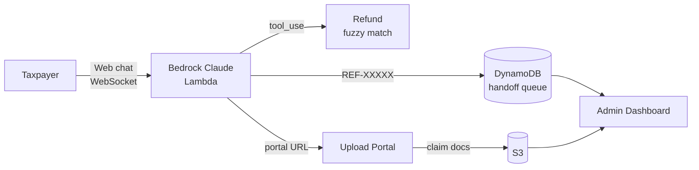

# Riverside County Tax Refund Bot

A web chat agent for the Riverside County Auditor-Controller's Office that helps taxpayers find and claim unclaimed refunds, plus an admin dashboard for staff to review submissions.



## What it does

- **Refund lookup chat.** Embedded chat widget on the auditor-controller website. The user gives a name, the bot fuzzy-matches against the refund dataset, asks an identity-verifying address quiz with decoys, then reveals refund details and a personalized claim-portal URL.
- **Unified claim form.** Single web form (driven by per-refund-type schemas in DynamoDB) replaces the old per-refund-type iframes. Claimants upload supporting docs; required documents are configurable per refund type with conditional rules.
- **Reference-number agent handoff.** If the user wants to talk to a real person, the bot generates a `REF-XXXXX`, persists the transcript, and tells them to call (951) 955-3800 with that reference. Admin dashboard surfaces pending handoffs with full conversation context.
- **Admin dashboard.** Cognito-authed Next.js dashboard for staff. Per-department visibility on submissions, status workflow, audit trail, AP-13 PDF preview of submitted claims, plus super-admin CRUD over departments / users / form schemas / doc requirements / refund-type labels / chat handoffs.
- **Notifications.** DynamoDB stream → Lambda → SES email when a submission's status changes.

## Architecture

See [ARCHITECTURE.md](ARCHITECTURE.md) for the full diagram, flow walkthrough, and design notes.

## Repo layout

```
.
├── app.py                          # CDK entry point
├── cdk/
│   ├── infrastructure.py           # The whole stack — one CDK file
│   ├── chat_system_prompt.md       # Bedrock Claude system prompt (loaded into SSM on deploy)
│   ├── runtime/                    # Tax-lookup Lambda (jellyfish + decoy quiz)
│   ├── chat_handler/               # WebSocket Lambda — Bedrock Claude with tool use
│   ├── upload_handler/             # REST API Lambda — presigned URLs, admin CRUD
│   ├── notification_handler/       # DynamoDB stream → SES email
│   └── upload_portal/              # Static portal site (unified claim form + chat widget)
├── admin-dashboard/                # Next.js admin UI (CodeBuild → S3 → CloudFront)
├── claimant-portal/                # Next.js claimant return portal (CodeBuild → S3)
├── forms/source/ap13-affidavit.pdf # Reference AP-13 PDF
├── refunds_demo_balanced.jsonl     # Demo refund dataset (gitignored)
├── auditor-controller-webpage.html # Mock auditor-controller.org site (gitignored)
├── config.yaml                     # Project config (region, super-admin, branch, model id)
├── ARCHITECTURE.md                 # Full architecture diagram + design notes
├── DEPLOYMENT_GUIDE.md             # Deploy / verify / troubleshoot
└── INTEGRATION_TESTS.md            # Manual test scenarios
```

## Quick start

```bash
# 1. Install
pip install -r requirements.txt
cd admin-dashboard && yarn install && cd ..

# 2. Configure (edit super_admin.email, notifications.sender, admin_dashboard.github_branch)
$EDITOR config.yaml

# 3. Push your branch (CodeBuild clones it for the dashboard build)
git push origin <your-branch>

# 4. Deploy
AWS_PROFILE=<profile> AWS_DEFAULT_REGION=us-west-2 cdk deploy --require-approval never
```

Stack outputs include the dashboard URL, chat WebSocket URL, upload portal URL, and the super-admin temp password. Detailed walkthrough in [DEPLOYMENT_GUIDE.md](DEPLOYMENT_GUIDE.md).

## Embedding the chat widget

After deploy, drop these tags into any HTML page that should host the chat:

```html
<link rel="stylesheet" href="<UploadPortalUrl>/chat-widget.css">
<script src="<UploadPortalUrl>/config.js"></script>
<script src="<UploadPortalUrl>/chat-widget.js" async></script>
```

`<UploadPortalUrl>` is a stack output. The widget reads `window.WS_ENDPOINT` from `config.js` and renders a bottom-right chat icon.

## Tools the agent can call

| Tool | Purpose |
|---|---|
| `tax_lookup` | Fuzzy-match a customer name against the refund dataset. Returns refunds + a personalized portal URL after the address quiz, or `address_verification` with decoy streets if not yet verified, or a no-match message |
| `request_agent` | Generate a 5-character `REF-XXXXX` reference, write a `HANDOFF` row to `chat-sessions`, surface the ref to the client. The user is told to call the office and quote it |
| `send_email` | Send an SES email to the user (e.g., portal link delivery) |

## Tech stack

- **AWS CDK** (Python) — single-stack architecture in `cdk/infrastructure.py`
- **AWS Lambda** (Python 3.12) — runtime, chat handler, upload handler, notification handler
- **Amazon Bedrock** — Claude Haiku 4.5 (`anthropic.claude-haiku-4-5`)
- **API Gateway** — WebSocket (chat) + REST (uploads + admin)
- **DynamoDB** — submissions, audit log, admin config (departments / users / schemas / doc reqs), chat sessions
- **S3 + CloudFront** — portal (S3 website) + admin dashboard (CloudFront-fronted private bucket)
- **Cognito** — admin user pool with super-admin and per-department groups
- **CodeBuild** — Next.js dashboard build on every `cdk deploy`
- **SES** — submission state-change notifications
- **`anthropic[bedrock]` SDK** — chat handler client
- **Next.js 14** + **shadcn/ui** + **Tailwind CSS** — admin dashboard

## License

See [LICENSE](LICENSE).
